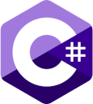
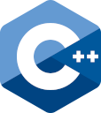
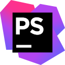

### Hi there, I'm Arthur - aka Eldoir 👋

## I'm a game dev, in Unity, Unreal and interested in everything else!

- ➡️ I have a [website][website] dedicated to my projects
- 🌱 I’m currently learning everything 🤣
- 🎮 I’m looking for a job in the video game industry
- 🥅 2020 Goals: Try Construct 3 and Godot
- ⚡ Fun fact: I pour my cereals before milk (like every sane person does).

### Connect with me:

[][website]
[][mail]
[][cv]
[][linkedin]

 

### Main Languages and Tools:

 

### Web:

 

---

  
📊 GitHub Stats

  

[website]: https://arthurcousseau.com
[mail]: mailto:@arthur.cousseau@me.com
[cv]: https://arthurcousseau.com/cv/CV_EN.pdf
[linkedin]: https://www.linkedin.com/in/arthurcousseau/
